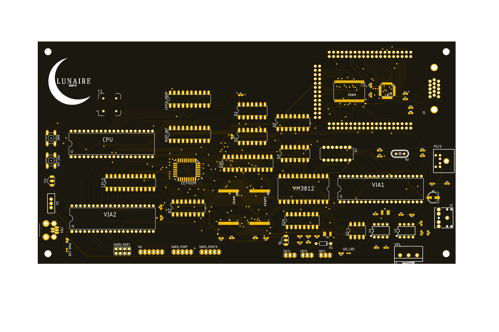

# Lunaire65816

My 16-bit retro computer I designed from scratch. It's centered around a 65816 CPU and uses classic components with FPGA-based glue logic, hardware FM sound, and modern display output.

## Features

- 65816 16-bit CPU
- Custom PCB design
- FPGA for glue logic and video generation
- YM3812 FM synthesis sound chip
- Dual VIA chips for I/O
- SNES controller headers
- PS/2 keyboard interface
- VGA output

## Architecture Overview

- CPU: WDC 65816
- Sound: YM3812 (OPL2)
- I/O: Two VIA chips
- Video: VGA generated using FPGA logic
- Input:
  - SNES controller ports
  - PS/2 keyboard
- Address decoding: GAL
- Board: Custom PCB

## Memory Map

Address decoding is handled by a GAL chip.

### 6502 Emulation Mode

- 48K RAM
- 4K I/O
- 12K ROM

This mode is useful for compatibility and early bring-up.

### 65816 Native Mode

- 4MB RAM
- 4K I/O (expandable, may increase later)
- 12K ROM

Native mode enables the full 24-bit address space of the 65816.

## Audio

The system uses a YM3812 (OPL2) FM synthesis chip for hardware-generated sound.

## Input

- SNES controller headers for gamepad input
- PS/2 keyboard support

## Video (unimplemented)

VGA output is generated through FPGA logic. The goal is compatibility with modern monitors. 

## Screenshots

Hardware:

## Hardware Design Notes

- Custom PCB layout
- Discrete retro components
- FPGA used for glue logic and video
- GAL used for address decoding
- VIA chips provide timers and general-purpose I/O

## Status

Work in progress. Basic hardware is assembled and bring-up is ongoing.

## License

This project is licensed under the GNU Lesser General Public License v3.0 or later.

See the LICENSE file for details.
